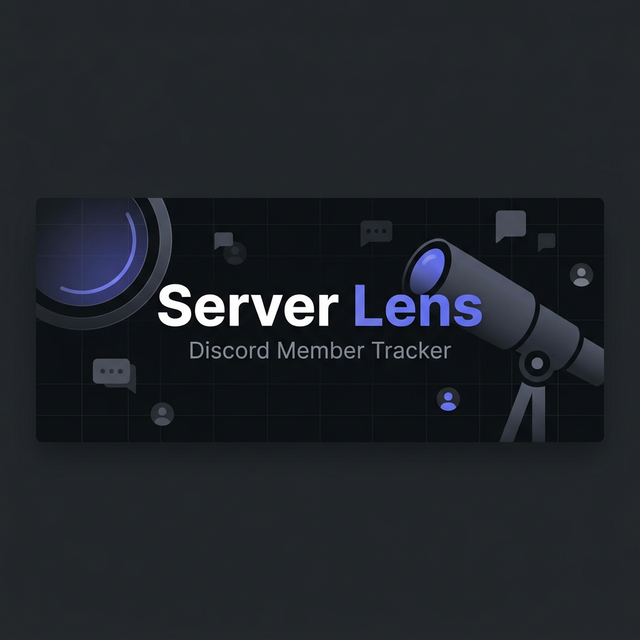
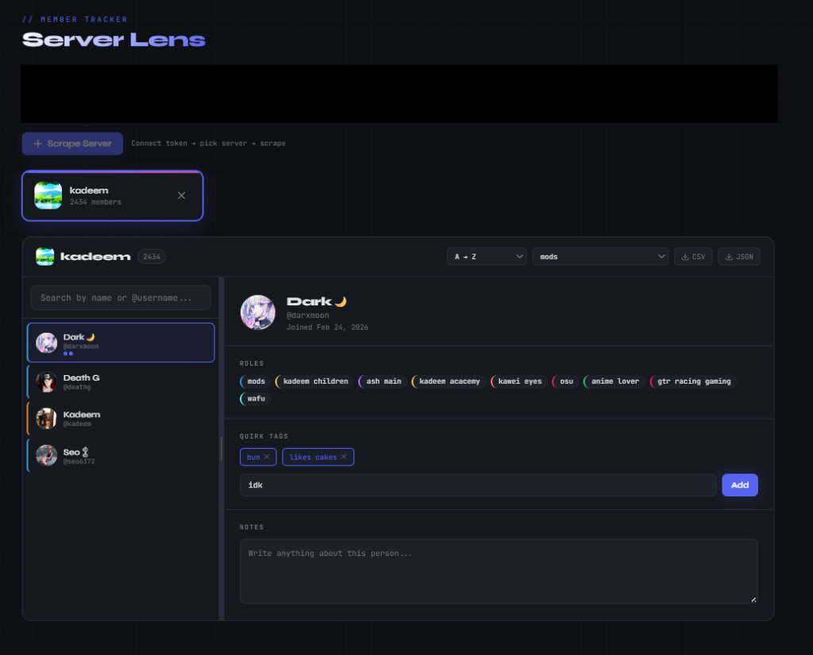

<p align="center">
  
</p>

<h3 align="center">Self-hosted Discord member scraper with real-time Gateway API access.</h3>

<p align="center">
  Scrape <b>all</b> server members (even offline) · Tag & annotate · Export CSV/JSON · Beautiful dark UI
</p>

<p align="center">
  <a href="#quick-start"></a>
  <a href="https://github.com/MuTe43/Discord-member-scraper/stargazers"></a>
  <a href="https://github.com/MuTe43/Discord-member-scraper/issues"></a>
</p>

<p align="center">
  
  
  
  
  
  
</p>

---

## 🖼️ Screenshot

<p align="center">
  
</p>

---

## ❓ Why Server Lens?

Discord's built-in member list only shows online users, hides behind slow scrolling, and offers zero annotation tools. **Server Lens** scrapes the *full* member list through Discord's Gateway API — including offline members — and gives you a beautiful interface to search, tag, annotate, and export your data.

| Feature | Discord Built-in | Server Lens |
|---------|:---:|:---:|
| See **all** members (including offline) | ❌ | ✅ |
| Export to CSV / JSON | ❌ | ✅ |
| Add custom tags per member | ❌ | ✅ |
| Personal notes per member | ❌ | ✅ |
| Search & filter by name | Slow scroll | ⚡ Instant |
| Sort by join date | ❌ | ✅ |
| Filter by Discord roles | ❌ | ✅ |
| Self-hosted, your data stays local | N/A | ✅ |

## ✨ Features

- 🔑 **Token-based auth** — paste your Discord user token to connect
- 🔭 **Full member scraping** — fetches all members via Gateway (op 14 range sweep + op 8 search sweep)
- 🤖 **Bot filtering** — automatically excludes bot accounts
- 🏷️ **Quirk tags** — add custom labels to any member (e.g. "lurker", "mod", "funny")
- 📝 **Notes** — write freeform notes per member, auto-saved
- 📦 **Export** — download member lists as CSV or JSON
- 🔄 **Re-scrape** — refresh anytime, existing tags & notes are preserved
- 🔍 **Search & filter** — instant search, sort by name/join date, filter by tags or roles
- 🎨 **Beautiful dark UI** — Discord-inspired aesthetics with JetBrains Mono typography
- 🔒 **Privacy-first** — 100% self-hosted, your token and data never leave your machine

## 🚀 Quick Start

### 🐳 Docker (Recommended)

```bash
git clone https://github.com/MuTe43/Discord-member-scraper.git
cd Discord-member-scraper
docker compose up
```

Open [http://localhost:8000](http://localhost:8000) and you're done.

### 🐍 Manual Setup

```bash
git clone https://github.com/MuTe43/Discord-member-scraper.git
cd Discord-member-scraper
pip install -r requirements.txt
cd backend
python main.py
```

Open [http://localhost:8000](http://localhost:8000) in your browser.

## 🔑 How to Get Your Discord Token

1. Open Discord in your **browser** → [discord.com/app](https://discord.com/app)
2. Open DevTools → `F12`
3. Go to the **Network** tab
4. Click anything or send a message
5. Find a request to `discord.com/api`
6. In the request headers, copy the **Authorization** value

> **⚠️ Warning:** Your token grants full access to your account. Never share it. Server Lens runs 100% locally — your token is never sent to any third party.

## 🏗️ Architecture

```
┌──────────────────────────────────────────────┐
│                   Browser                    │
│  ┌──────────┐  ┌──────────┐  ┌───────────┐  │
│  │ index.html│  │ style.css│  │  app.js   │  │
│  └──────────┘  └──────────┘  └───────────┘  │
└──────────────────────┬───────────────────────┘
                       │ HTTP / SSE
┌──────────────────────┴───────────────────────┐
│              FastAPI Backend                 │
│  ┌──────────┐  ┌──────────┐  ┌───────────┐  │
│  │ main.py  │  │scraper.py│  │gateway.py │  │
│  │ (routes) │  │ (scrape) │  │ (session) │  │
│  └──────────┘  └──────────┘  └───────────┘  │
│  ┌──────────┐  ┌──────────────────────────┐  │
│  │models.py │  │     data.json (local)    │  │
│  └──────────┘  └──────────────────────────┘  │
└──────────────────────┬───────────────────────┘
                       │ WebSocket + REST
               ┌───────┴────────┐
               │ Discord API v9 │
               └────────────────┘
```

## 📡 API Endpoints

| Method | Endpoint | Description |
|--------|----------|-------------|
| `POST` | `/api/validate-token` | Validate token + get user's guilds |
| `POST` | `/api/scrape` | Scrape a server's member list (SSE stream) |
| `GET` | `/api/servers` | Get all scraped servers |
| `GET` | `/api/servers/{id}/members` | Get members of a server |
| `PATCH` | `/api/servers/{id}/members/{mid}` | Update quirks/notes for a member |
| `DELETE` | `/api/servers/{id}` | Delete a server and its data |
| `GET` | `/health` | Health check endpoint |

## 📁 Project Structure

```
server-lens/
├── backend/
│   ├── main.py          # FastAPI app + routes
│   ├── gateway.py       # Discord Gateway session manager
│   ├── scraper.py       # Member scraping logic + REST helpers
│   └── models.py        # Pydantic request models
├── frontend/
│   ├── index.html       # Page structure
│   ├── style.css        # All styles (dark theme)
│   └── app.js           # Application logic
├── assets/
│   └── banner.png       # Project banner
├── Dockerfile
├── docker-compose.yml
├── requirements.txt
├── CONTRIBUTING.md
└── LICENSE
```

## 🛡️ Security & Privacy

- **100% local** — your Discord token is stored only in your browser's `sessionStorage` and sent directly to Discord's API. It never touches any third-party server.
- **Security headers** — CSP, X-Frame-Options, and X-Content-Type-Options are enabled by default.
- **Atomic writes** — data is saved atomically to prevent corruption on crashes.
- **Open source** — audit every line of code yourself.

## 🤝 Contributing

Contributions are welcome! See [CONTRIBUTING.md](CONTRIBUTING.md) for guidelines.

Whether it's bug fixes, new features, or UI improvements — PRs are appreciated!

## 🗺️ Roadmap

- [ ] SQLite storage for better performance with large servers
- [ ] Virtual scrolling for 10k+ member servers
- [ ] Discord REST API rate-limit handling
- [ ] Bulk tagging / multi-select members
- [ ] Dark/light theme toggle
- [ ] Browser extension for one-click scraping

> Have an idea? [Open a feature request →](https://github.com/MuTe43/Discord-member-scraper/issues/new?template=feature_request.md)

## 💬 Community & Support

- 🐛 Found a bug? [Open an issue](https://github.com/MuTe43/Discord-member-scraper/issues/new?template=bug_report.md)
- 💡 Feature request? [Let us know](https://github.com/MuTe43/Discord-member-scraper/issues/new?template=feature_request.md)
- ⭐ Like the project? Give it a **star** — it helps others find it!

## ⭐ Star History

<p align="center">
  <a href="https://star-history.com/#MuTe43/Discord-member-scraper&Date">
    
  </a>
</p>

## 📄 License

[MIT](LICENSE) — use it, fork it, build on it.

---

<p align="center">
  <b>If Server Lens saved you time, consider giving it a ⭐</b><br>
  <sub>Built with 🖤 using <a href="https://fastapi.tiangolo.com/">FastAPI</a> + vanilla JS</sub>
</p>
